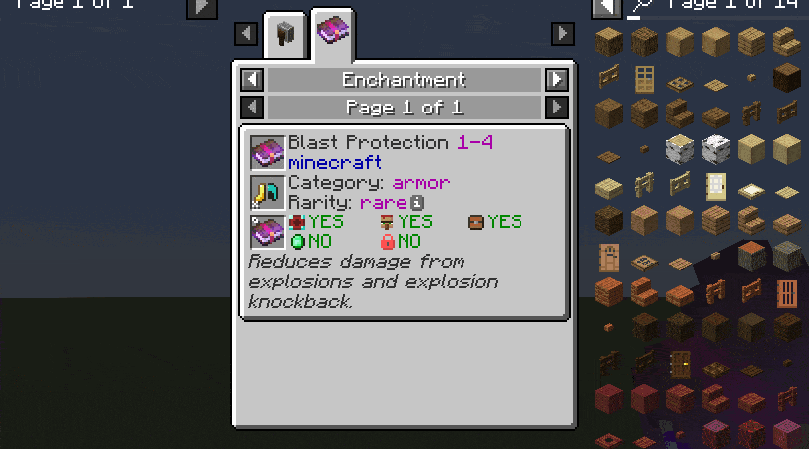

# EMI Enchants

[EMI](https://modrinth.com/mod/emi) addon to view enchantment information.

* Displays:
  * Enchantment name, mod, max level
  * Category and list of items it can be applied to
  * Rarity, weight, cost per level (see [wiki](https://minecraft.wiki/w/Enchantment_weight))
  * List of conflicting enchantments
  * Whether the enchantment can be obtained from enchanting table
  * Whether it can be bought from villager
  * Whether it can be obtained from various loot sources (chests, fishing, mob equipment drops)
  * Whether it considered a treasure (villagers sell it at x2 price)
  * Wheter it's a curse
  * Description, if provided by mod or resource pack. Check out [Enchantment Descriptions](https://modrinth.com/mod/enchantment-descriptions)
* Check uses of an item to see applicable enchants
* Check recipes or uses of enchanted book to see its enchantment stats. Currently works only with books with a single enchantment, due to EMI limitations.